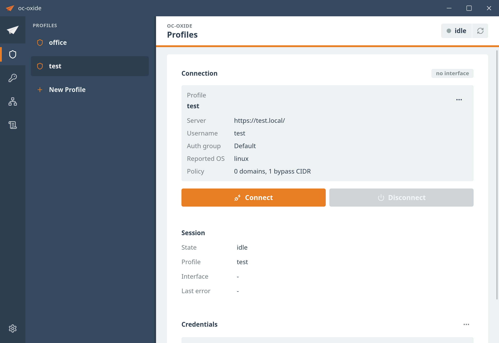

<p align="center">
  
</p>

<h1 align="center">oc-oxide</h1>

<p align="center">
  A Rust/Tauri OpenConnect helper with a daemon-owned VPN control plane.
</p>

<p align="center">
  
  
  
  
</p>

<p align="center">
  <a href="https://oc-oxide.glp.ai">Website</a>
  ·
  <a href="https://github.com/fudanglp/oc-oxide/releases">Releases</a>
  ·
  <a href="https://oc-oxide.glp.ai/privacy.html">Privacy</a>
  ·
  <a href="docs/README.md">Docs</a>
</p>

`oc-oxide` keeps the proven OpenConnect protocol engine in C through
`libopenconnect`, while moving desktop integration, daemon IPC, auth prompts,
route/DNS policy, diagnostics, and recovery into Rust.

The project is Linux-first and under active development. The desktop workflow
is usable for early testing.

<p align="center">
  
</p>

## Features

- Tauri desktop app for local VPN profile management and connect/disconnect.
- Privileged daemon owns `libopenconnect`, TUN, route, DNS, IPC, polkit, and
  crash recovery.
- Typed auth prompts for username, password, authgroup, and OTP/second-factor
  flows.
- Reversible route and DNS policy, including local-network bypasses such as
  OpenClash fake-ip ranges.
- Optional OS keyring storage for VPN account passwords.
- Developer CLI, `ocx`, for daemon status, diagnostics, connect, and
  disconnect.
- Optional GitHub Cloud Sync for non-secret profile snapshots in a private
  repository.
- Linux tarball and Debian package helpers for early distribution.

## Install

Linux release artifacts are published through
[GitHub Releases](https://github.com/fudanglp/oc-oxide/releases). Current
artifacts include a Debian package and a portable tarball.

One-line installer:

```sh
curl -LsSf https://oc-oxide.glp.ai/install.sh | sh
```

Install a specific release:

```sh
curl -LsSf https://oc-oxide.glp.ai/install.sh | sh -s -- --version v0.1.1
```

The installer downloads the matching GitHub Release artifact, verifies its
`.sha256` file, and installs the Debian package when possible. Non-Debian
systems fall back to the tarball installer.

Debian package:

```sh
sudo apt install ./oc-oxide_<version>_<deb-arch>.deb
```

Tarball:

```sh
tar -xzf oc-oxide-<version>-linux-<arch>.tar.gz
cd oc-oxide-<version>-linux-<arch>
sudo ./install.sh
```

The installer/package enables and restarts the idle system daemon when systemd
is available. Starting the daemon does not connect a VPN profile by itself.

See [docs/DISTRIBUTION.md](docs/DISTRIBUTION.md) for package layout, systemd
behavior, signing, apt repository metadata, updater metadata, and artifact
verification.

Uninstall:

```sh
sudo apt remove oc-oxide
```

For tarball installs:

```sh
sudo /usr/local/libexec/oc-oxide/uninstall.sh
```

Removal stops and disables the daemon but leaves user profiles, keyring
entries, and system profiles under `/etc/oc-oxide` in place.

## Quick Start

After installing, open the desktop app from the application launcher, add a
non-secret VPN profile, and connect from the app.

For local development, start the daemon in one terminal:

```sh
make daemon
```

In another terminal, run the desktop app:

```sh
make app
```

For CLI-driven development:

```sh
target/debug/ocx status
target/debug/ocx diagnostics
target/debug/ocx connect office
target/debug/ocx disconnect
```

The default IPC socket is `/tmp/oc-oxide-daemon.sock`. Set
`OC_OXIDE_DAEMON_SOCKET` only when testing a non-default socket.

## Profiles

Profiles are local, non-secret TOML files. The desktop app can create and edit
them from the UI. For CLI-first setup, create:

```text
~/.config/oc-oxide/profiles/<name>.toml
```

Minimal shape:

```toml
[connection]
server = "https://vpn.example.test:555/"
reported_os = "linux"
authgroup = "engineering"
username = "alice"

[company]
domains = ["corp.example.test"]

[local]
bypass = ["198.18.0.0/15"]
```

Only `connection.server` is required. Do not put passwords, OTP values,
cookies, private keys, real VPN endpoints, or sensitive internal network
details in committed files.

## Cloud Sync

Cloud Sync is optional and lives in the desktop Settings view. It uses GitHub
device flow, stores the GitHub refresh token in the OS keyring, keeps access
tokens in memory, and writes only non-secret profile snapshots to the selected
private repository.

Cloud Sync must not store VPN passwords, OTP values, session cookies, private
keys, client certificate passphrases, router credentials, daemon tokens, or
temporary auth-form answers. See the
[privacy notes](https://oc-oxide.glp.ai/privacy.html) and
[docs/SECURITY_MODEL.md](docs/SECURITY_MODEL.md) for the trust boundary.

## Security Model

`oc-oxide-daemon` is the privileged boundary. It owns the active
`libopenconnect` session, TUN setup/teardown, route and DNS policy, IPC state,
and startup recovery from `/run/oc-oxide/session.json`.

The Tauri desktop app runs unprivileged and talks to the daemon over IPC. The
daemon records only non-secret reversible network state in its runtime journal.
Secrets must not be written to profile files, sync objects, logs, diagnostics,
tests, docs, or repository files.

See [docs/SECURITY_MODEL.md](docs/SECURITY_MODEL.md) for the full privilege,
polkit, keyring, sync, and redaction model.

## Architecture

At a high level:

```text
desktop app / ocx CLI
        |
        v
privileged oc-oxide-daemon
        |
        v
libopenconnect + TUN + route/DNS policy
```

Only the tunnel crates call `libopenconnect`; route, DNS, config, IPC, sync,
and UI code operate on Rust-owned snapshots and typed events.

See [docs/ARCHITECTURE.md](docs/ARCHITECTURE.md) for the workspace map, crate
responsibilities, runtime model, and daemon/client split.

## Development

Development currently targets Linux.

You will need:

- Rust 1.89+
- Node.js and npm for the desktop app
- system build tools used by the vendored OpenConnect build, including
  autotools, `make`, `pkg-config`, `clang`/`libclang`, and OpenSSL development
  headers
- Tauri 2 Linux prerequisites for running the desktop shell
- `systemd-resolved` for the current DNS backend

Normal local loop:

```sh
make daemon
make app
```

Useful verification commands:

```sh
make test
make check
```

See [docs/DEVELOPMENT.md](docs/DEVELOPMENT.md) for local profile setup,
targeted test commands, manual real-VPN E2E checks, and troubleshooting.

## Documentation

- [docs/README.md](docs/README.md): documentation index
- [docs/ONBOARDING.md](docs/ONBOARDING.md): contributor orientation and
  project boundaries
- [docs/ARCHITECTURE.md](docs/ARCHITECTURE.md): crate boundaries and runtime
  model
- [docs/SECURITY_MODEL.md](docs/SECURITY_MODEL.md): privilege and secret
  handling
- [docs/DEVELOPMENT.md](docs/DEVELOPMENT.md): local development and manual E2E
- [docs/DISTRIBUTION.md](docs/DISTRIBUTION.md): packages and release artifacts

Archived design records are linked from [docs/README.md](docs/README.md).

## License

MIT
